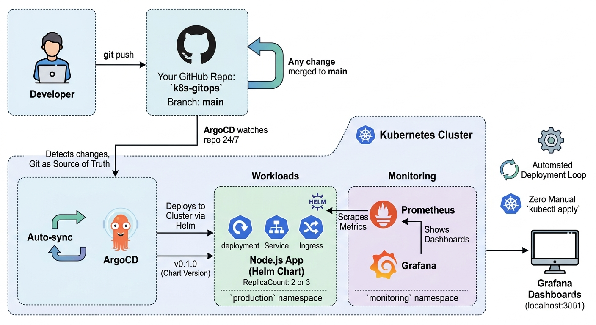
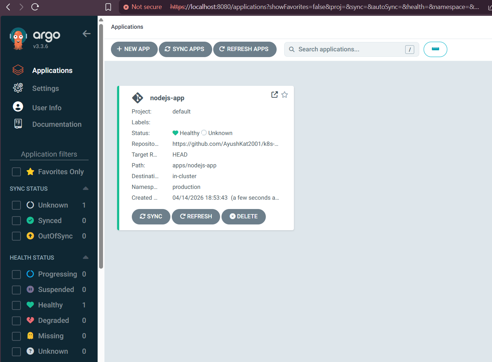
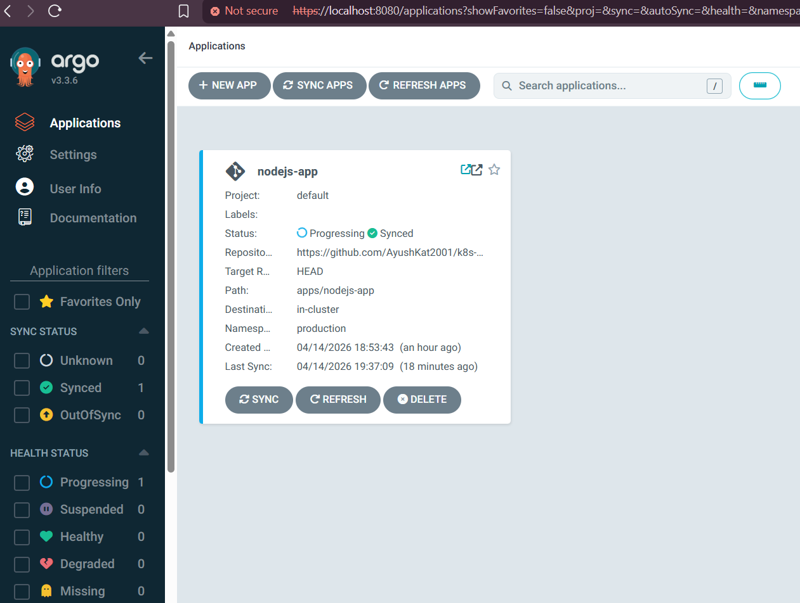
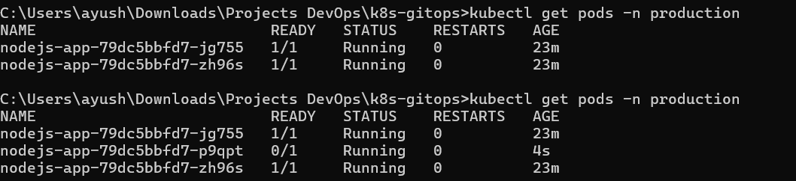
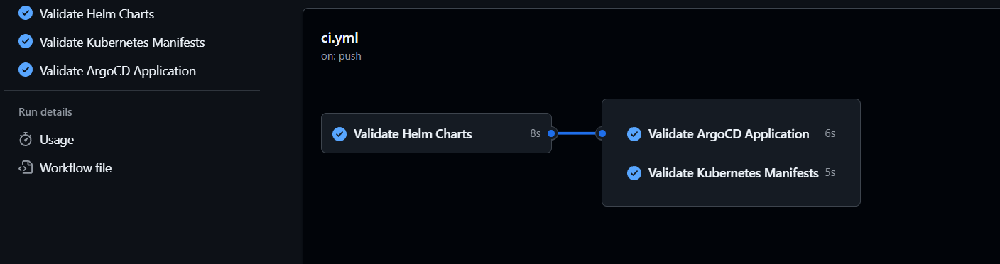
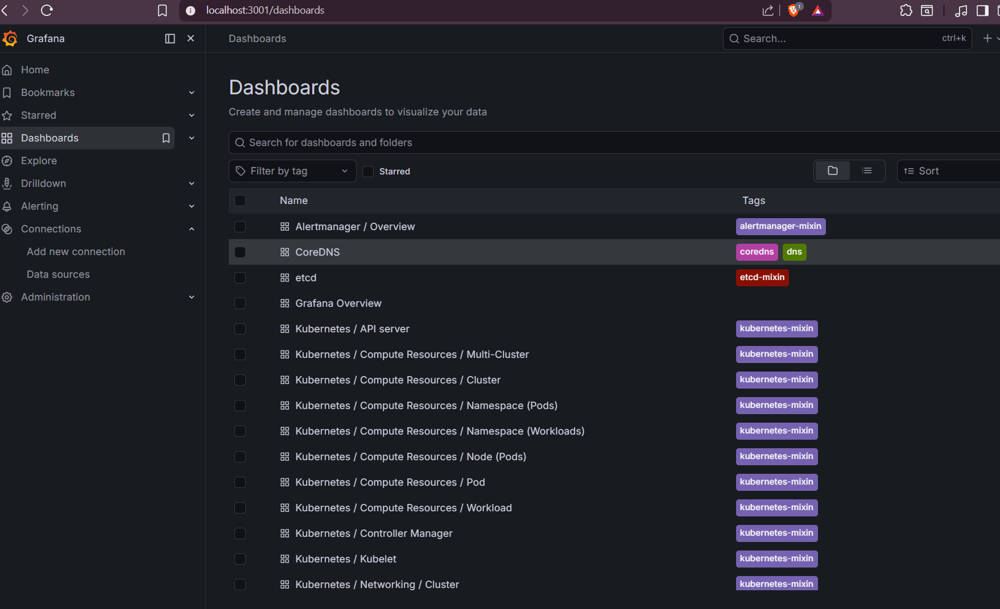

<div align="center">

# ☸️ Kubernetes GitOps Pipeline

**A production-style Kubernetes setup where Git is the single source of truth.**
Every change merged to main automatically syncs to the cluster via ArgoCD — no manual `kubectl apply` ever.



</div>

---

## 💡 What is this?

I built this to understand how GitOps works in practice — specifically how teams manage Kubernetes deployments without touching the cluster directly.

The idea is simple: you change a value in Git, push it, and ArgoCD detects the change and updates the cluster automatically. Scale from 2 to 3 replicas? Change one number in `values.yaml` and push. ArgoCD handles the rest.

---

## 🔄 How it works

```
Developer pushes to main
         ↓
GitHub Actions validates Helm charts + manifests
         ↓
ArgoCD detects the change (polls every 3 minutes)
         ↓
ArgoCD syncs cluster to match Git state
         ↓
Prometheus scrapes metrics → Grafana shows dashboards
```

---

## 🛠️ Stack

<table>
  <tr>
    <th>Tool</th>
    <th>Purpose</th>
  </tr>
  <tr>
    <td>Minikube</td>
    <td>Local Kubernetes cluster</td>
  </tr>
  <tr>
    <td>Helm</td>
    <td>Package and version Kubernetes apps</td>
  </tr>
  <tr>
    <td>ArgoCD</td>
    <td>GitOps continuous delivery</td>
  </tr>
  <tr>
    <td>Prometheus</td>
    <td>Metrics collection</td>
  </tr>
  <tr>
    <td>Grafana</td>
    <td>Metrics dashboards</td>
  </tr>
  <tr>
    <td>GitHub Actions</td>
    <td>Validates charts and manifests on every push</td>
  </tr>
  <tr>
    <td>kubeconform</td>
    <td>Kubernetes manifest schema validation</td>
  </tr>
</table>

---

## 📁 Project Structure

```
k8s-gitops/
├── apps/
│   └── nodejs-app/
│       ├── Chart.yaml              # Helm chart metadata
│       ├── values.yaml             # All configurable values
│       └── templates/
│           ├── deployment.yaml     # Pod spec and replicas
│           ├── service.yaml        # Internal cluster networking
│           └── ingress.yaml        # External traffic routing
├── infrastructure/
│   ├── argocd/
│   │   └── application.yaml       # Tells ArgoCD what repo to watch
│   └── monitoring/
│       └── values.yaml            # Prometheus + Grafana config
└── .github/
    └── workflows/
        └── ci.yml                 # Helm lint + manifest validation
```

---

## 🚀 Running Locally

**Prerequisites:** Docker Desktop, Minikube, kubectl, Helm

**1. Start the cluster**

```bash
minikube start --memory=4096 --cpus=2 --driver=docker
```

**2. Install ArgoCD**

```bash
kubectl create namespace argocd
kubectl apply -n argocd -f https://raw.githubusercontent.com/argoproj/argo-cd/stable/manifests/install.yaml
kubectl wait --for=condition=Ready pods --all -n argocd --timeout=300s
```

**3. Access the ArgoCD dashboard**

```bash
# Get admin password
kubectl -n argocd get secret argocd-initial-admin-secret \
  -o jsonpath="{.data.password}" | base64 -d && echo

# Forward the port
kubectl port-forward svc/argocd-server -n argocd 8080:443
```

Visit `https://localhost:8080` → login with `admin` and the password above.

**4. Deploy the app via ArgoCD**

```bash
kubectl apply -f infrastructure/argocd/application.yaml
```

ArgoCD will detect your GitHub repo and sync the app to the `production` namespace automatically.

-- <b>Before Sync</b>


-------------------------------------------------------------------------
-- <b>After Sync</b>


**5. Install Prometheus + Grafana**

```bash
kubectl create namespace monitoring
helm repo add prometheus-community https://prometheus-community.github.io/helm-charts
helm repo update

helm install monitoring prometheus-community/kube-prometheus-stack \
  -n monitoring \
  -f infrastructure/monitoring/values.yaml
```

```bash
# Access Grafana at http://localhost:3001
kubectl port-forward svc/monitoring-grafana -n monitoring 3001:80
```

Login with `admin` / `devops123`

---

## ⚙️ GitOps in action

This is the core of the project. To scale the app from 2 to 3 replicas — don't touch kubectl. Just change one line in Git:

```yaml
# apps/nodejs-app/values.yaml
replicaCount: 3
```

```bash
git add apps/nodejs-app/values.yaml
git commit -m "scale: increase replicas to 3"
git push origin main
```

Within 3 minutes ArgoCD detects the change and scales the deployment automatically.

```bash
# Verify it
kubectl get pods -n production
```



---

## 📋 CI Pipeline

The GitHub Actions workflow runs on every push and PR to `main`. It validates your infrastructure code before anything reaches the cluster.

<table>
  <tr>
    <th>Job</th>
    <th>What it does</th>
  </tr>
  <tr>
    <td>Helm lint</td>
    <td>Checks the chart for syntax errors and missing required fields</td>
  </tr>
  <tr>
    <td>Helm template + kubeconform</td>
    <td>Renders Helm templates into raw Kubernetes YAML and validates against the official API schema</td>
  </tr>
  <tr>
    <td>ArgoCD manifest validation</td>
    <td>Dry-run validation on the ArgoCD application manifest to catch config errors before they're applied</td>
  </tr>
</table>

> The goal: never merge broken Kubernetes config into main. ArgoCD would immediately try to deploy it and break the cluster.



---

## 📊 Monitoring

Prometheus scrapes metrics from every pod automatically. Grafana comes pre-configured with dashboards for:

- CPU and memory usage per pod
- Node health and resource pressure
- Deployment rollout status
- Network traffic in and out



---

## 📝 What I learned building this

The GitOps model feels different at first — your instinct is to run `kubectl apply` directly. The shift is trusting Git as the source of truth and letting ArgoCD do the applying.

The interesting parts were getting ArgoCD to sync with a public GitHub repo, understanding how Helm templating works under the hood, and setting up kubeconform in CI to catch schema errors before they hit the cluster. The `selfHeal: true` flag in ArgoCD is also worth knowing — if someone manually changes something in the cluster directly, ArgoCD reverts it back to match Git within minutes.
